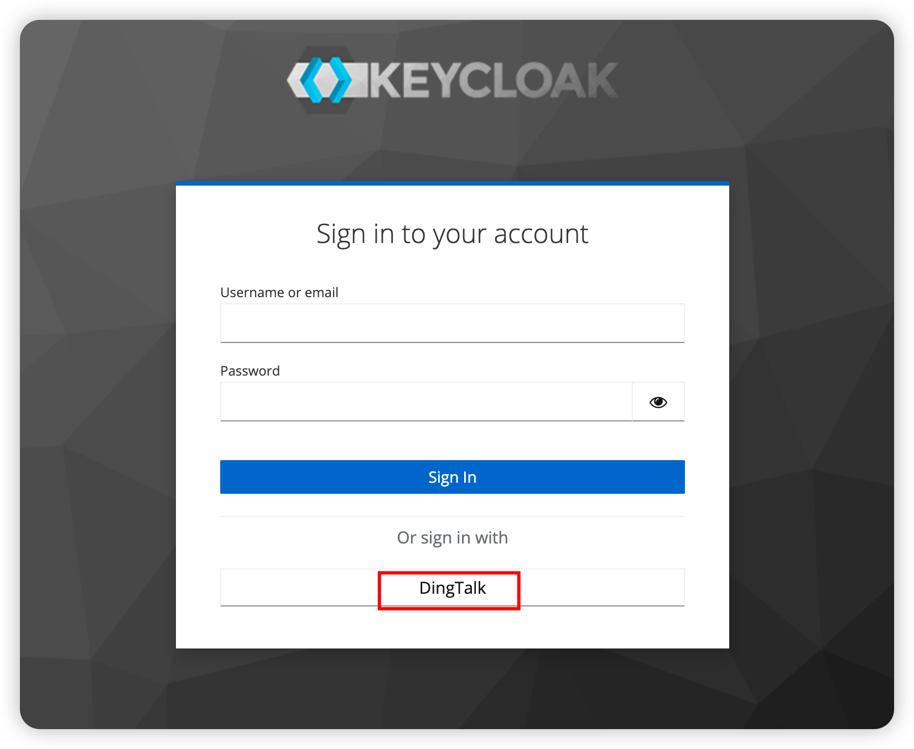
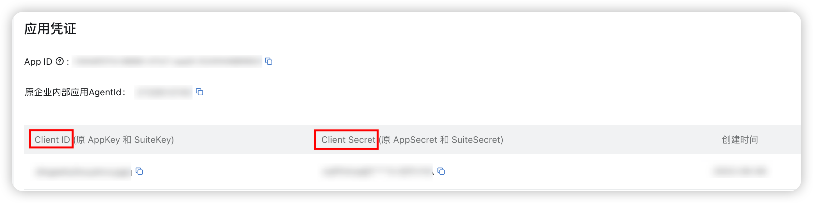
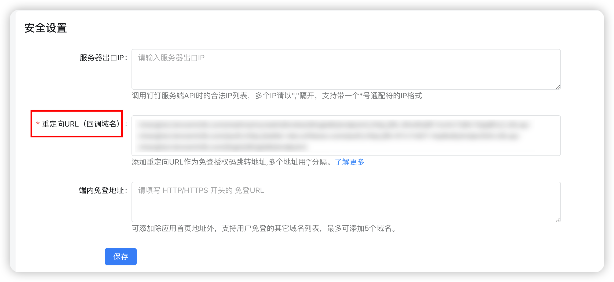
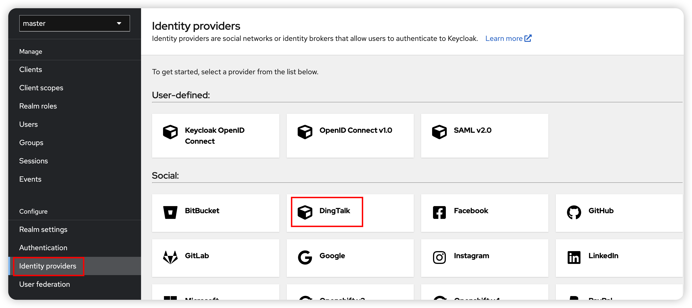
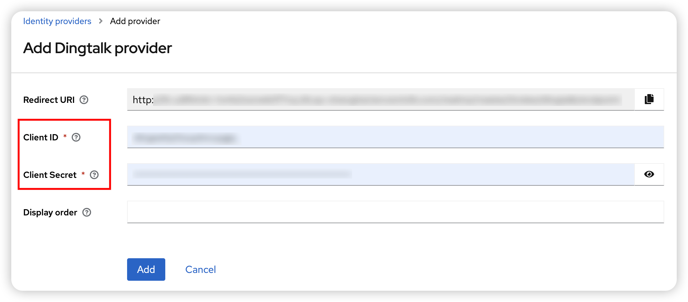

# keycloak-dingtalk-social-identity-provider

Keycloak Social Login 插件（IDP） —— 钉钉登陆。

> Keycloak HA 部署至 Kubernetes 集群，可参考如下文档：
> 
> [🔗 GitBook](https://yangsijie151104.gitbook.io/keycloak-on-k8s-ha-bu-shu/)
> 
> [🔗 CSDN](http://t.csdnimg.cn/f2PZr)
> 
> [🔗 掘金](https://juejin.cn/post/7366836510690672675)
> 
> [🔗 Notion](https://believed-stallion-f40.notion.site/Keycloak-on-K8S-HA-e19576ca2cd448338debf66a16e9b6a6?pvs=4)

## 🌟 效果



##  ⚙️ 安装

| Keycloak 版本     | 是否支持 |
|-----------------|------|
| 23.0.4 ~ 24.0.3 | ✅    |
| 其他              | ❌    |

###  🤖 源码构建

在代码根目录构建 jar 包：

```shell
mvn clean install
```

在 `target` 目录下可见 `keycloak-dingtalk-social-identity-provider-{version}.jar`。

将其部署至 Keycloak 的 `$KEYCLOAK_HOME/providers` 目录中。

> Keycloak 默认的 providers 目录为 `/opt/keycloak/providers/`

### 🎃 容器部署

#### 🌈 获取容器镜像

这里的镜像是集成了钉钉登陆 IDP 的 keycloak。

##### 方式一 - 自构建

在代码根目录执行：

```shell
# 以下方式选其一
# 直接使用 docker
docker build -t keycloak-dingtalk:23.0.4 .

# 使用 buildkit
docker buildx build -f ./Dockerfile --push --platform linux/arm64/v8,linux/amd64 --tag keycloak-dingtalk:23.0.4 .
```

##### 方式二 - 使用已构建镜像

已事先将容器镜像推送至阿里云，直接拉取使用即可：

```shell
docker pull registry.cn-hangzhou.aliyuncs.com/yangsijie666/yangsijie:keycloak-dingtalk-23.0.4
```

#### 🏵️ 运行容器

执行以下命令：

```shell
docker run --name keycloak -e KEYCLOAK_ADMIN=admin -e KEYCLOAK_ADMIN_PASSWORD=admin -p 8080:8080 镜像名 start-dev
```

访问 `http://localhost:8080` 即可登陆 Keycloak。

### 🍾 Kubernetes 部署

在代码根目录，执行以下命令：

```shell
kubectl apply -f k8s.yaml
```

##  🛠️ 配置

### 🥙 钉钉

参照[钉钉文档](https://open.dingtalk.com/document/orgapp/tutorial-obtaining-user-personal-information)在钉钉侧配置用于登陆的应用信息，从钉钉应用中可以获取 `clientId` 和 `clientSecret` 信息。



并在该应用下配置登陆后的 **重定向 URL**。

> ⚠️ 该配置需等 Keycloak 中配置完 DingTalk 登陆插件后，再配置。



### 🧀 Keycloak

在目标 Realm（这里） 中选择 Identity Providers，选择 `DingTalk`。



在配置页填入从钉钉侧获取的`ClientId` 和 `ClientSecret`。

> 这里的 **Redirect URI** 即用来复制粘贴进钉钉侧的 **重定向 URL**。



